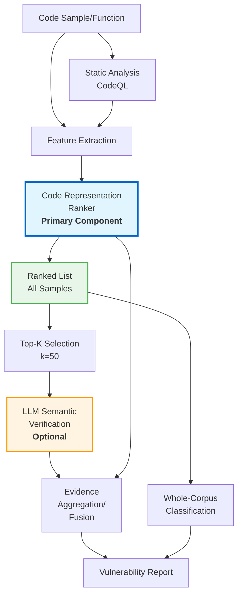

**Figure 1: SemVulGuard Architecture**

**Key Components**:
- **Ranker (Blue)**: Primary whole-corpus detection component
- **LLM Verification (Orange)**: Optional top-k semantic verification (5% coverage)
- **Ranked List (Green)**: All samples scored, enabling both whole-corpus and top-k analysis

**Data Flow**:
1. Code samples processed through static analysis (CodeQL) and feature extraction
2. Ranker scores all samples (primary performance driver)
3. Two parallel paths:
   - Whole-corpus classification (all samples)
   - Top-k selection → LLM verification → fusion (selective enhancement)
4. Final vulnerability report combines ranking with optional semantic reasoning

**Architectural Principles**:
- **Modular**: Each component operates independently
- **Flexible**: LLM verification is optional, not required
- **Cost-effective**: LLM applied only to top-k (5%) candidates
- **Ranker-driven**: Primary detection capability from ranker, not LLM
