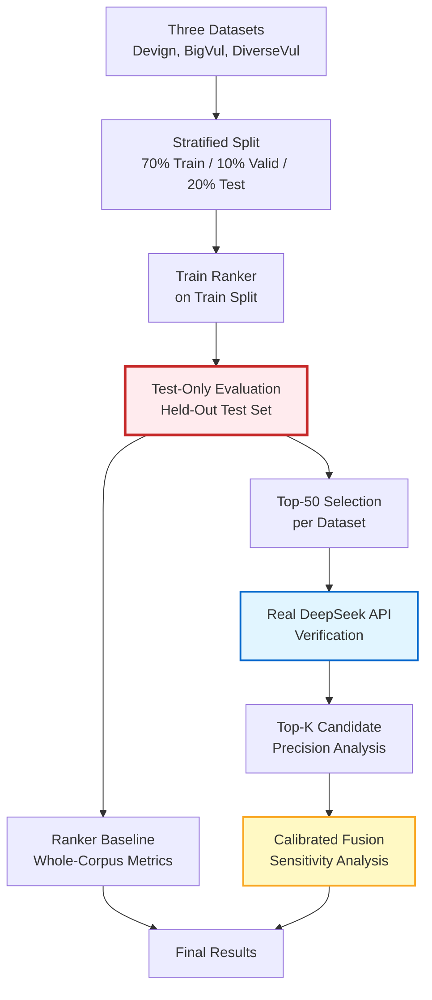

**Figure 2: Experimental Workflow**

**Key Stages**:
- **Stratified Split (70/10/20)**: Ensures balanced train/valid/test distribution
- **Test-Only Evaluation (Red)**: Strict held-out testing with no hyperparameter tuning on test data
- **Real API Verification (Blue)**: 150 DeepSeek API calls (50 per dataset), 100% success rate
- **Calibrated Fusion (Yellow)**: Sensitivity analysis, not primary performance claim

**Evaluation Protocol**:
1. Train ranker on 70% training data (3,500 samples per dataset)
2. Evaluate on 20% held-out test data (1,000 samples per dataset)
3. Select top-50 ranked candidates per dataset
4. Verify with real DeepSeek API (total cost: $0.125)
5. Analyze top-k precision improvements
6. Explore fusion strategies (751 configs per dataset)

**Scientific Rigor**:
- No test-set tuning (fixed threshold 0.5)
- No cross-contamination between splits
- Real API calls (not simulated)
- Honest reporting of all results (including negative)
